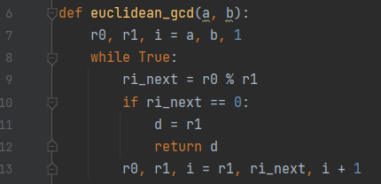
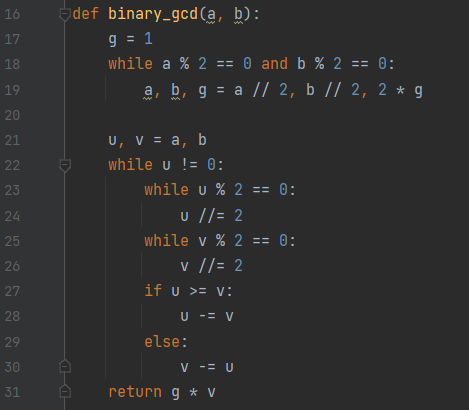
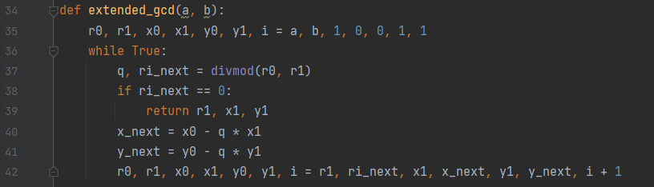
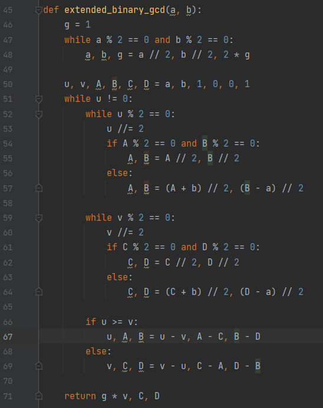
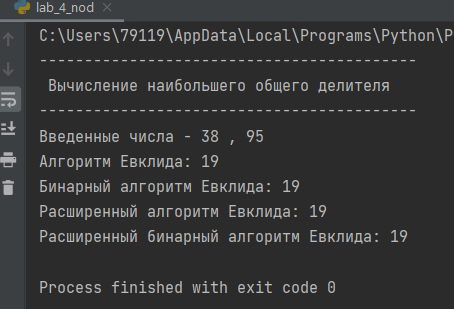

---
# Front matter
title: "Лабораторная работа 4"
author: "Попов Дмитрий Павлович, НФИмд-01-23"

# Generic otions
lang: ru-RU
toc-title: "Содержание"

# Bibliography
bibliography: bib/cite.bib
csl: pandoc/csl/gost-r-7-0-5-2008-numeric.csl

# Pdf output format
toc: true # Table of contents
toc_depth: 2
lof: true # List of figures
lot: true # List of tables
fontsize: 12pt
linestretch: 1.5
papersize: a4
documentclass: scrreprt
## I18n
polyglossia-lang:
  name: russian
  options:
	- spelling=modern
	- babelshorthands=true
polyglossia-otherlangs:
  name: english
### Fonts
mainfont: PT Serif
romanfont: PT Serif
sansfont: PT Sans
monofont: PT Mono
mainfontoptions: Ligatures=TeX
romanfontoptions: Ligatures=TeX
sansfontoptions: Ligatures=TeX,Scale=MatchLowercase
monofontoptions: Scale=MatchLowercase,Scale=0.9
## Biblatex
biblatex: true
biblio-style: "gost-numeric"
biblatexoptions:
  - parentracker=true
  - backend=biber
  - hyperref=auto
  - language=auto
  - autolang=other*
  - citestyle=gost-numeric
## Misc options
indent: true
header-includes:
  - \linepenalty=10 # the penalty added to the badness of each line within a paragraph (no associated penalty node) Increasing the value makes tex try to have fewer lines in the paragraph.
  - \interlinepenalty=0 # value of the penalty (node) added after each line of a paragraph.
  - \hyphenpenalty=50 # the penalty for line breaking at an automatically inserted hyphen
  - \exhyphenpenalty=50 # the penalty for line breaking at an explicit hyphen
  - \binoppenalty=700 # the penalty for breaking a line at a binary operator
  - \relpenalty=500 # the penalty for breaking a line at a relation
  - \clubpenalty=150 # extra penalty for breaking after first line of a paragraph
  - \widowpenalty=150 # extra penalty for breaking before last line of a paragraph
  - \displaywidowpenalty=50 # extra penalty for breaking before last line before a display math
  - \brokenpenalty=100 # extra penalty for page breaking after a hyphenated line
  - \predisplaypenalty=10000 # penalty for breaking before a display
  - \postdisplaypenalty=0 # penalty for breaking after a display
  - \floatingpenalty = 20000 # penalty for splitting an insertion (can only be split footnote in standard LaTeX)
  - \raggedbottom # or \flushbottom
  - \usepackage{float} # keep figures where there are in the text
  - \floatplacement{figure}{H} # keep figures where there are in the text
---

<h1 align="center">

РОССИЙСКИЙ УНИВЕРСИТЕТ ДРУЖБЫ НАРОДОВ 

Факультет физико-математических и естественных наук  

Кафедра математического моделирования и искусственного интеллекта

ОТЧЕТ ПО ЛАБОРАТОРНОЙ РАБОТЕ №4
  
<h2 align="right">

дисциплина: Математические основы защиты информации и информационной безопасности

Преподователь: Кулябов Дмитрий Сергеевич

Студент: Попов Дмитрий Павлович

Группа: НФИмд-01-23
  
  
<h1 align="center">

МОСКВА

2023 г.
</h1>

# Цель работы

Целью данной работы является освоить на практике алгоритмы вычисления НОД.[1]

# Выполнение лабораторной работы

Требуется реализовать:

1. Алгоритм Евклида
2. Бинарный алгоритм Евклида
3. Расширенный алгоритм Евклида
4. Расширенный бинарный алгоритм Евклида

## Алгоритм Евклида

Основные шаги:

1. Берёт два числа a и b, где a > b

2. Повторяет деление a на b, заменяя a значением b и b остатком от деления, пока b не станет равным 0.

3. Последнее ненулевое значение a будет НОД.

Реализация на Python предствлена на рисунке 1 [@fig:001].

{#fig:001 width=80%}

## Бинарный алгоритм Евклида

Основные шаги:

1. Если оба числа четные, делит оба числа на 2 и удваивает итоговый НОД

2. Если только одно из чисел четное, делит только его на 2.

3. Из большего числа вычитает меньшее.

4. Повторяет процесс, пока числа не станут равными. Это число становится НОД, умноженным на полученный ранее множитель.

Реализация на Python предствлена на рисунке 2 [@fig:002].

{#fig:002 width=80%}

## Расширенный алгоритм Евклида

Основные шаги:

1. Кроме нахождения НОД, алгоритм находит такие числа x и y, что ax+by=НОД(a,b).

2. Начинается с базовых коэф.: x0 = 1, y0 = 0 (для а) и x1 = 0, y1 = 1 (для b).

3. При каждом шаге обновляются значения коэффициентов, используя остаток и частное от деления.

Реализация на Python предствлена на рисунке 3 [@fig:003].

{#fig:003 width=80%}

## Расширенный бинарный алгоритм Евклида

Основные шаги:

1. Как и обычный бинарный алгоритм, но также отслеживает коэффициенты x и y.

2. Когда числа делятся на 2, коэффициенты корректируются соответствующим образом.

3. Когда из одного числа вычитается другое, соответствующие коэффициенты также вычитаются.

Реализация на Python предствлена на рисунке 4 [@fig:004].

{#fig:004 width=80%}

## Результат работы программы

Выходные значения программы [@fig:005].

{#fig:005 width=80%}

# Выводы

В результате выполнения работы я освоил на практике применение алгоритмов нахождения НОД.

# Список литературы

1. Методические материалы курса
