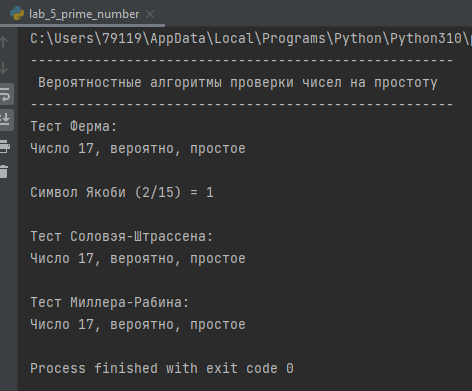

---
# Front matter
title: "Лабораторная работа 5"
author: "Попов Дмитрий Павлович, НФИмд-01-23"

# Generic otions
lang: ru-RU
toc-title: "Содержание"

# Bibliography
bibliography: bib/cite.bib
csl: pandoc/csl/gost-r-7-0-5-2008-numeric.csl

# Pdf output format
toc: true # Table of contents
toc_depth: 2
lof: true # List of figures
lot: true # List of tables
fontsize: 12pt
linestretch: 1.5
papersize: a4
documentclass: scrreprt
## I18n
polyglossia-lang:
  name: russian
  options:
	- spelling=modern
	- babelshorthands=true
polyglossia-otherlangs:
  name: english
### Fonts
mainfont: PT Serif
romanfont: PT Serif
sansfont: PT Sans
monofont: PT Mono
mainfontoptions: Ligatures=TeX
romanfontoptions: Ligatures=TeX
sansfontoptions: Ligatures=TeX,Scale=MatchLowercase
monofontoptions: Scale=MatchLowercase,Scale=0.9
## Biblatex
biblatex: true
biblio-style: "gost-numeric"
biblatexoptions:
  - parentracker=true
  - backend=biber
  - hyperref=auto
  - language=auto
  - autolang=other*
  - citestyle=gost-numeric
## Misc options
indent: true
header-includes:
  - \linepenalty=10 # the penalty added to the badness of each line within a paragraph (no associated penalty node) Increasing the value makes tex try to have fewer lines in the paragraph.
  - \interlinepenalty=0 # value of the penalty (node) added after each line of a paragraph.
  - \hyphenpenalty=50 # the penalty for line breaking at an automatically inserted hyphen
  - \exhyphenpenalty=50 # the penalty for line breaking at an explicit hyphen
  - \binoppenalty=700 # the penalty for breaking a line at a binary operator
  - \relpenalty=500 # the penalty for breaking a line at a relation
  - \clubpenalty=150 # extra penalty for breaking after first line of a paragraph
  - \widowpenalty=150 # extra penalty for breaking before last line of a paragraph
  - \displaywidowpenalty=50 # extra penalty for breaking before last line before a display math
  - \brokenpenalty=100 # extra penalty for page breaking after a hyphenated line
  - \predisplaypenalty=10000 # penalty for breaking before a display
  - \postdisplaypenalty=0 # penalty for breaking after a display
  - \floatingpenalty = 20000 # penalty for splitting an insertion (can only be split footnote in standard LaTeX)
  - \raggedbottom # or \flushbottom
  - \usepackage{float} # keep figures where there are in the text
  - \floatplacement{figure}{H} # keep figures where there are in the text
---

<h1 align="center">

РОССИЙСКИЙ УНИВЕРСИТЕТ ДРУЖБЫ НАРОДОВ 

Факультет физико-математических и естественных наук  

Кафедра математического моделирования и искусственного интеллекта

ОТЧЕТ ПО ЛАБОРАТОРНОЙ РАБОТЕ №5
  
<h2 align="right">

дисциплина: Математические основы защиты информации и информационной безопасности

Преподователь: Кулябов Дмитрий Сергеевич

Студент: Попов Дмитрий Павлович

Группа: НФИмд-01-23
  
  
<h1 align="center">

МОСКВА

2023 г.
</h1>

# Цель работы

Освоить на практике алгоритмы проверки чисел на простоту.[1]

# Выполнение лабораторной работы

Требуется реализовать:

1. Алгоритм, реализующий тест Ферма
2. Алгоритм вычисления символа Якоби
3. Алгоритм, реализующий тест Соловэя-Штрассена
4. Алгоритм, реализующий тест Миллера-Рабина.

## Алгоритм, реализующий тест Ферма

Алгоритм основан на малой теореме Ферма, которая утверждает, что если n - простое число, то для любого целого числа a, не являющегося кратным n, выполняется a^(n-1) ≡ 1 (mod n).
Алгоритм выбирает случайные значения a и проверяет условие. Если оно не выполняется для какого-либо a, то n считается составным. Если оно выполняется для всех выбранных a, то n вероятно является простым.

Реализация на Python предствлена на рисунке 1 [@fig:1].

{#fig:1 width=80%}

## Символ Якоби

Символ Якоби обобщает символ Лежандра и используется для определения вычетов в кольце вычетов по модулю n.
Для нечетного простого числа n и целого числа a, символ Якоби Jacobi(a, n) равен 1, если a является квадратичным вычетом по модулю n, -1, если a является квадратичным невычетом, и 0, если a кратно n.
Символ Якоби используется в различных алгоритмах для проверки простоты и для решения квадратичных уравнений по модулю.

Реализация на Python предствлена на рисунке 2 [@fig:2].

{#fig:2 width=80%}

## Тест Соловэя-Штрассена

Этот алгоритм использует символ Якоби и проверяет, является ли число простым.
Алгоритм выбирает случайное целое число a и проверяет два условия: 1) a не делится на n, и 2) символ Якоби Jacobi(a, n) равен результату вычисления с использованием символа Лежандра.
Если оба условия выполняются для всех выбранных a, то n вероятно является простым числом.

Реализация на Python предствлена на рисунке 3 [@fig:3].

{#fig:3 width=80%}

## Тест Миллера-Рабина

Этот алгоритм также использует вероятностный метод для проверки простоты числа.
Алгоритм выбирает случайное целое число a и разлагает n - 1 на 2^s * d, где s - четное, и d нечетное.
Затем алгоритм проверяет условия Миллера-Рабина: 1) a^d ≡ 1 (mod n), и 2) для всех i от 0 до s-1, a^(2^i * d) ≡ -1 (mod n) или a^(2^i * d) ≡ 1 (mod n).
Если оба условия выполняются для всех выбранных a, то n вероятно является простым числом.

Реализация на Python предствлена на рисунке 4 [@fig:4].

{#fig:4 width=80%}

## Результат работы программы

функция запуска [@fig:5].

{#fig:5 width=80%}

Выходные значения программы [@fig:6].

{#fig:6 width=80%}

# Выводы

В результате выполнения работы я освоил на практике применение алгоритмов проверки чисел на простоту.

# Список литературы

1. Методические материалы курса
